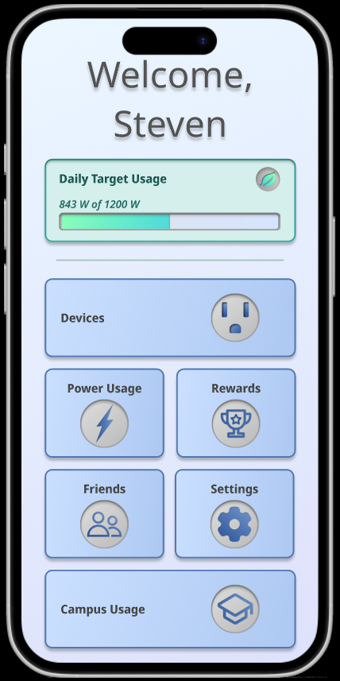
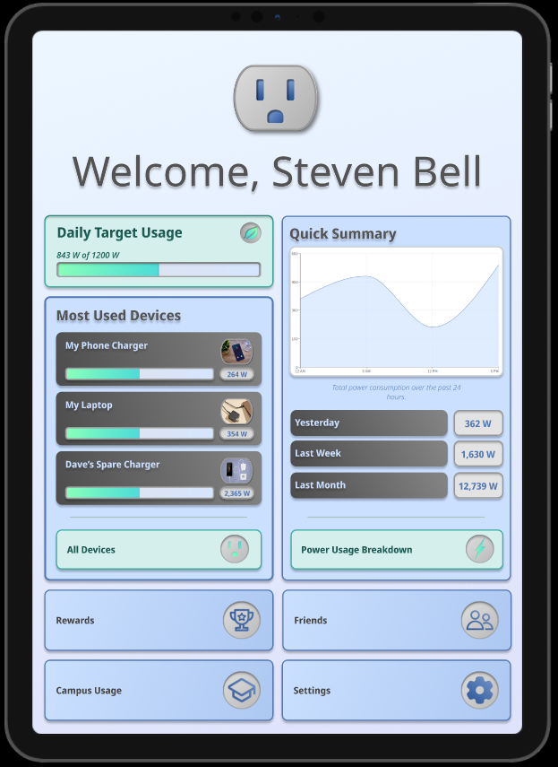
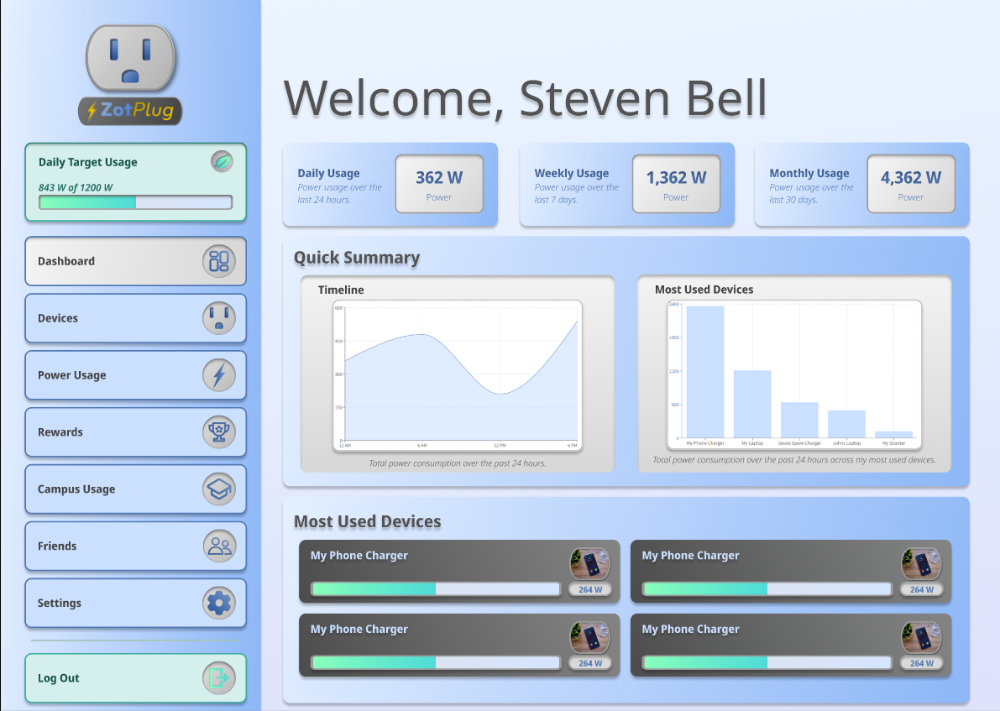
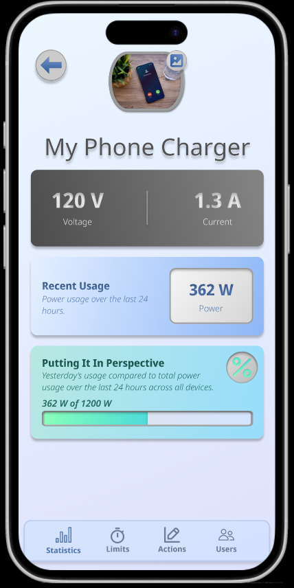
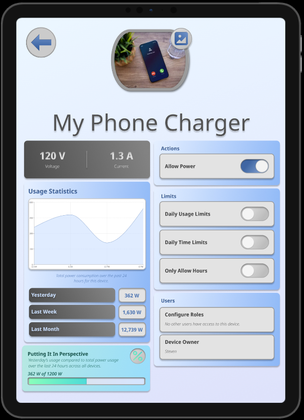
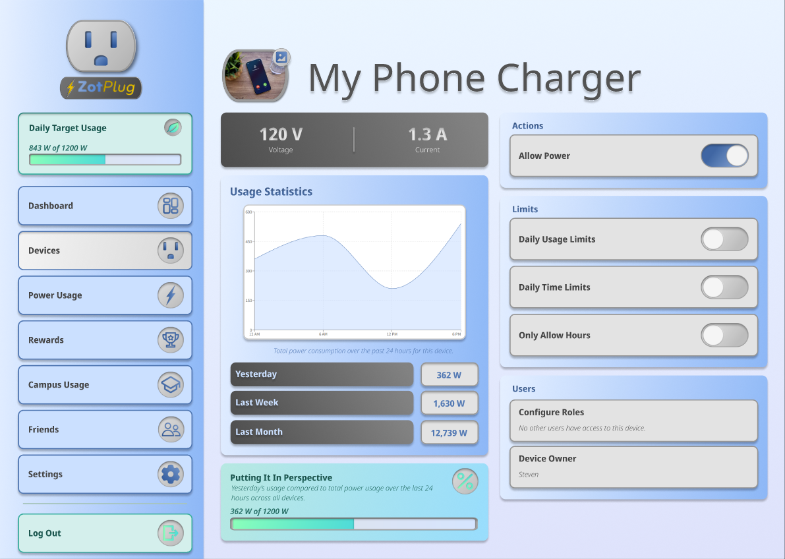
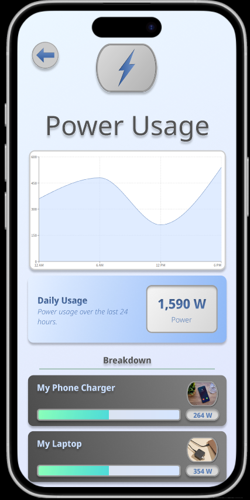
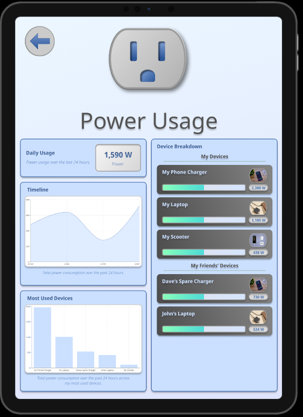
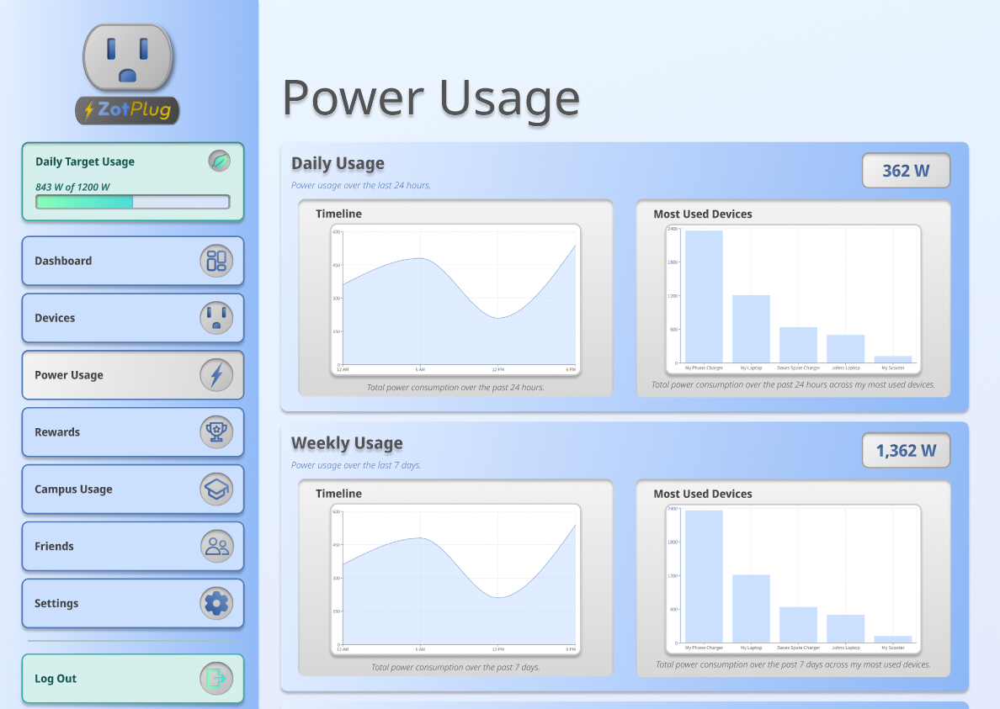

# ZotPlug Frontend

## About the Project

This is the full-stack web and mobile frontend for our smart plug senior design project, entitled the ZotPlug. 

**TODO: Expand this section.**

## Screenshots

Mobile   |      Tablet   |  Desktop
:-------:|:-------------:|:-------------------------:
  |   | 
  |   | 
  |   | 
  |   | 


## Tech Stack

### Web

* **Framework:** React / Next.js / react-native-web
* **Styling:** Tailwind CSS
* **Tooling:** TypeScript / ESLint

### Mobile

* **Framework:** React / Expo / react-native
* **Styling:** CSS / nativewind
* **Tooling:** TypeScript

## Getting Started

### Prerequisites

In order to run the project, you will need to have Node.js and npm installed.

* [Node.js](https://nodejs.org/) (v22.20.0+)
* [npm](https://www.npmjs.com/)  (10.9.3+)

### Installation

Setting up the project is a two step process because our frontend has both a Next.js website and an Expo mobile app.

#### Setting up Web

Navigate to the appropriate directory and install the `npm` packages.

```bash
cd web
npm install
```

#### Setting up Mobile

At this point in time, we have only tested the physical app on Android for development purposes, but our codebase is designed to be cross-platform and IOS development could be carried out via the iOS simulator.

1. Simulator approach:
    - [Android SDK Setup Guide](https://docs.expo.dev/workflow/android-studio-emulator/)
    - [iOS Simulator Setup Guide](https://docs.expo.dev/workflow/ios-simulator/)

2. Physical approach (only supported for Android):
    - [Expo Go](https://play.google.com/store/apps/details?id=host.exp.exponent&hl=en_US)

**TODO: Update this to account for the custom expo SDK.**

After installing the tools, copy over the `.env` file in the `./mobile` directory.

```bash
# Open .env and change it to your local IP
API_URL=http://YOUR_LOCAL_IP:4000
```

Finally, install the `npm` packages while still in the `./mobile` directory.

```bash
cd mobile
npm install
```

### Development Workflow

Here's the general development process once the tools are installed:

1. Launch the backend:
    - Start the backend server by following the steps in our [Platform Development Workflow](https://github.com/ZotPlug/zot_plug_platform).

2. Launch the web or mobile environment:
    ```bash
    # Web Dev
    cd web
    npm run dev

    # Mobile dev
    cd mobile
    npm run android # or: npm run ios
    ```

## Team

- Christopher Chandler, CSE
- Jonghyun Choi, CE
- Justin Chang, EE
- Kyle Chun, CSE
- Prabhav Goyal, CSE
