# Welcome to ZotPlug

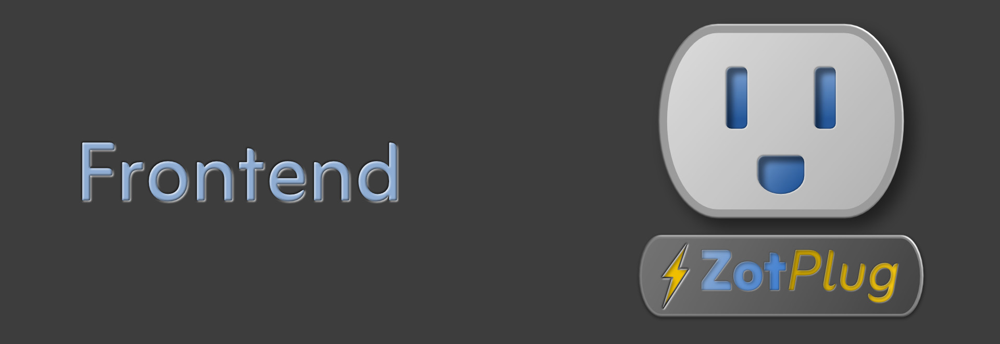

Welcome to ZotPlug! This is the web and mobile frontend for our smart plug IoT solution. 

## Project Poster & Technical Report

- The Full Resolution PDF version of the project poster can be found [here](https://drive.google.com/file/d/1YAu_NmLsX2b73EIh_0wYKdVRCQuiZaFI/view?usp=sharing).
- The CECS Technical Report for this project can be found [here](https://drive.google.com/file/d/1-i85gJRUpZhGmp5RH3hY3M24phBMnEef/view?usp=sharing).

## About the Project

University dormitories experience significant energy waste because many electronic devices remain plugged in and idle for extended periods of time. 
Studies estimate that these energy vampires account for nearly 30% of unnecessary energy consumption in dormitory environments. 
To address this issue, we developed ZotPlug, a smart outlet system designed to monitor and control energy usage at the individual outlet level. 
ZotPlug measures real-time energy consumption using a dedicated power metering integrated circuit connected to an ESP32 microcontroller and transmits telemetry to a cloud-based platform.
Through a dashboard application, we enabled users to visualize energy usage, remotely-control connected devices, and configure scheduling features that promote more efficient electricity use. 
The platform also incorporated behavioral incentives that encourage students to reduce consumption through friendly competition and usage awareness. 
Our experimental evaluation demonstrated that the system could obtain accurate measurements within 5% of the expected values across a wide range of device loads. 
Ultimately, we showed that ZotPlug can provide reliable outlet-level energy monitoring and seamlessly integrated into a scalable cloud system with an intuitive user interface while supporting UC Irvine’s long-term sustainability goals.

## Frontend Screenshots

Mobile   |      Tablet   |  Desktop
:-------:|:-------------:|:-------------------------:
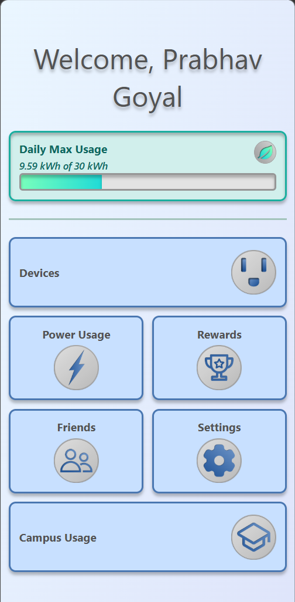  |  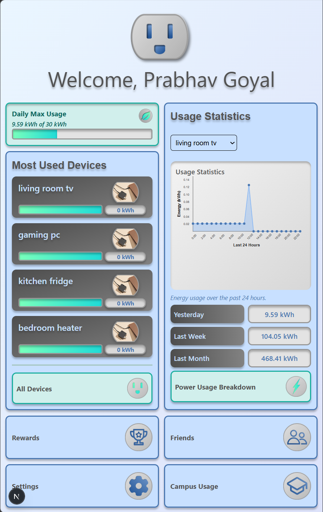 | 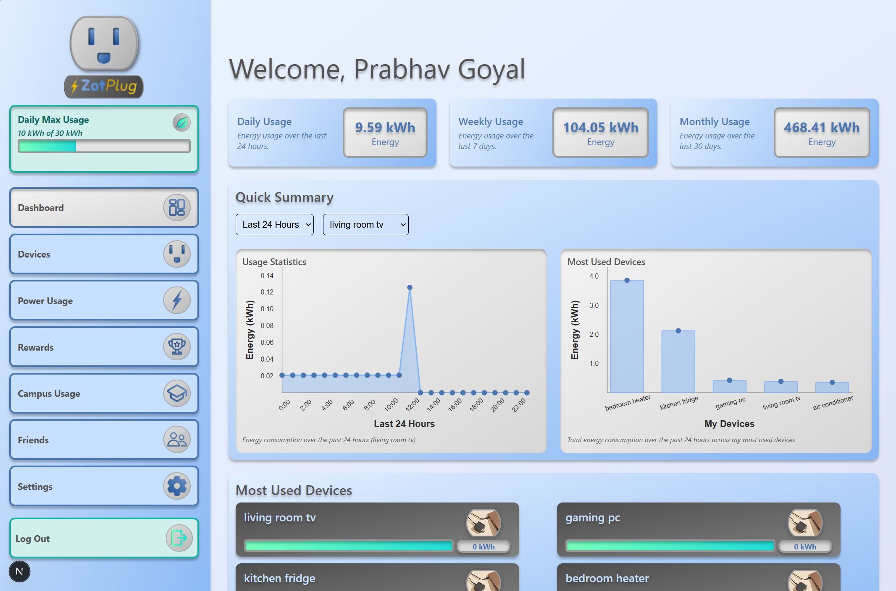
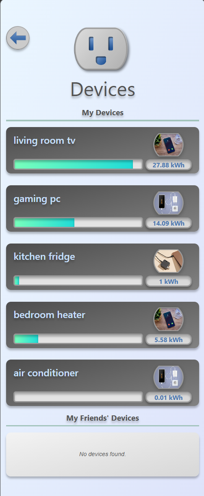  |  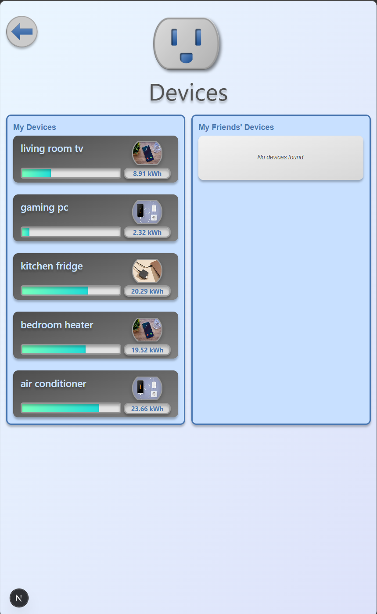 | 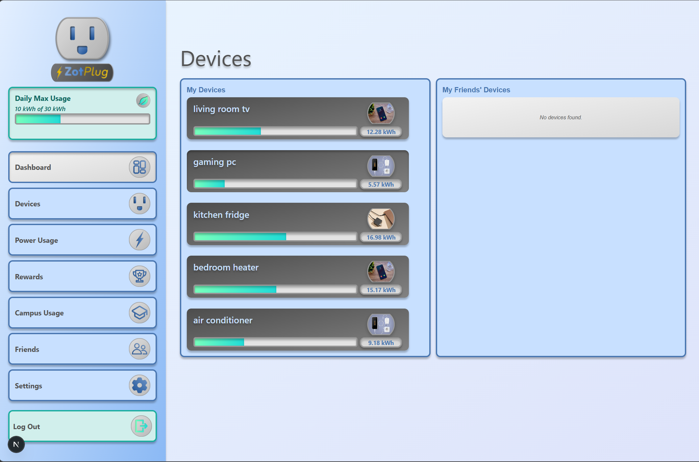
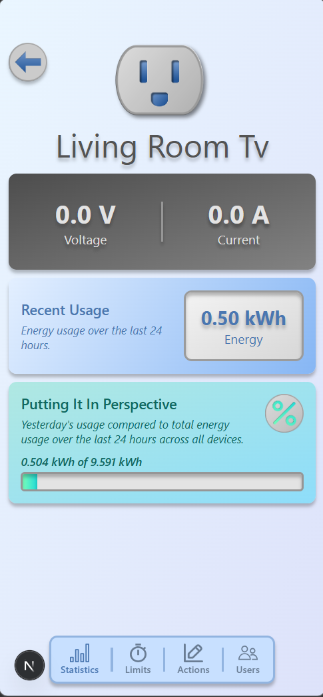  |  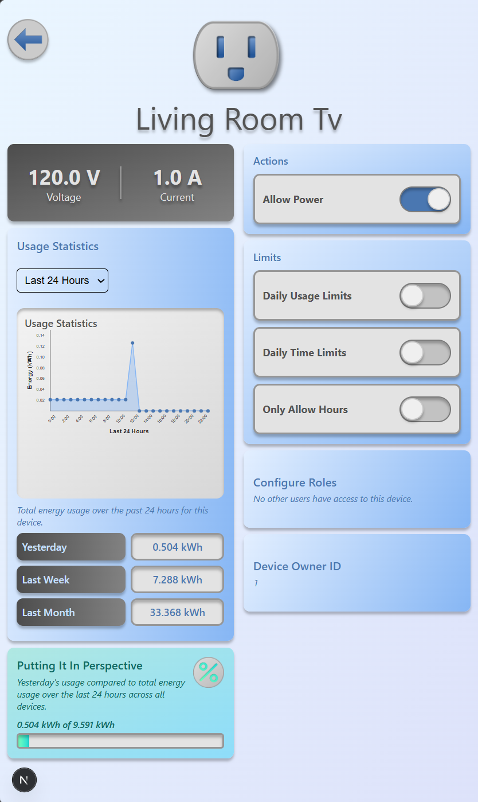 | 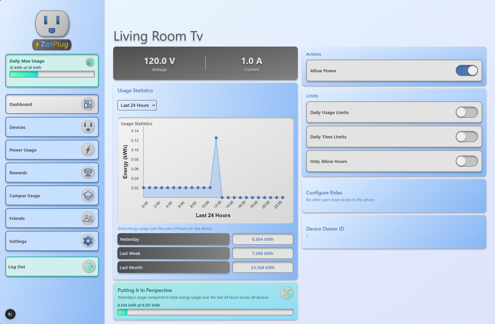
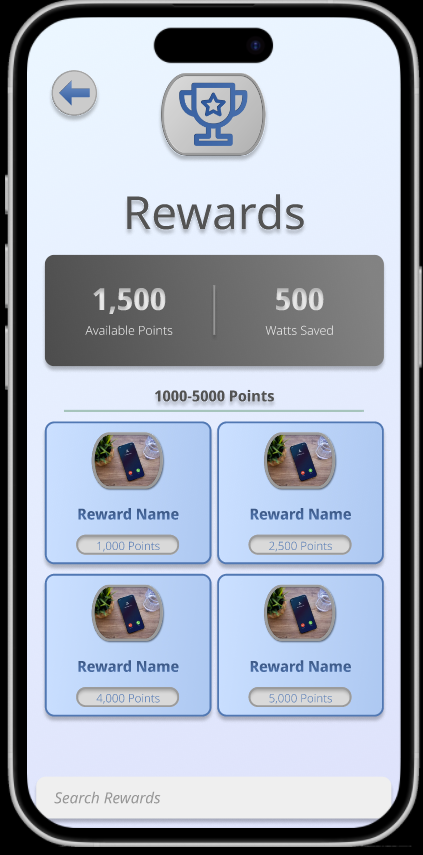  |  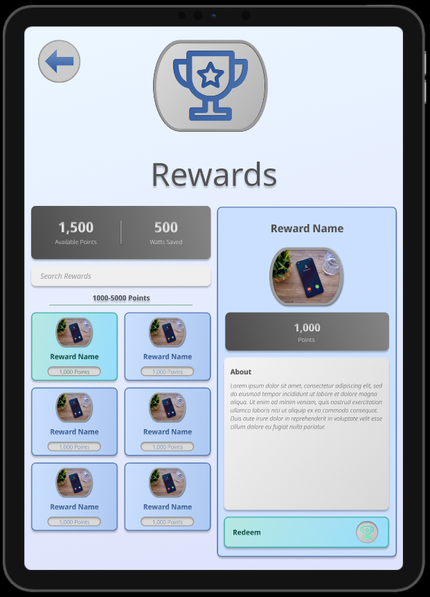 | 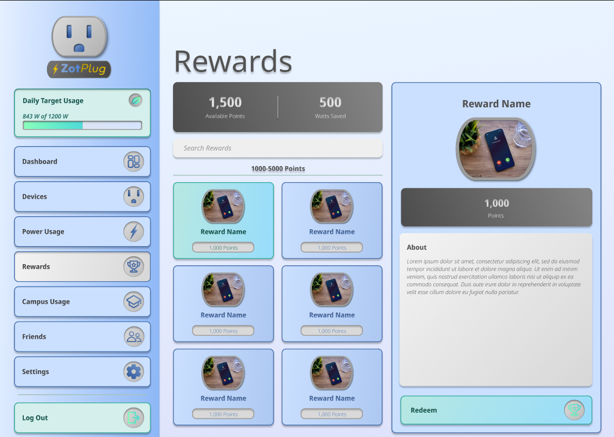

- Our original Figma mockups can be found [here](https://www.figma.com/design/dw3y7hFy7QFzpmszKbPreA/Smart-Plug-App?node-id=0-1&t=lliT51LSGRrXIoug-1).
- Our original Whimsical wireframes can be found [here](https://whimsical.com/smart-plug-app-wireframe-EWnzqGRQS4T8irnKhbsf8z).

## Tech Stack

### Web

* **Framework:** React / Next.js / react-native-web
* **Styling:** Tailwind CSS
* **Tooling:** TypeScript / ESLint

### Mobile

* **Framework:** React / Expo / react-native
* **Styling:** CSS / nativewind
* **Tooling:** TypeScript

## Development
Please see our [Getting Started](https://github.com/ZotPlug/zot_plug_frontend/wiki/Getting-Started) instructions.
